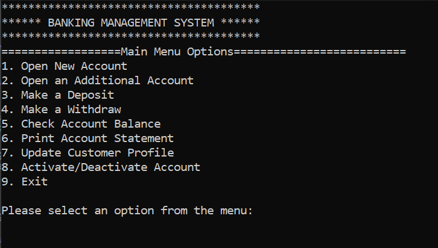
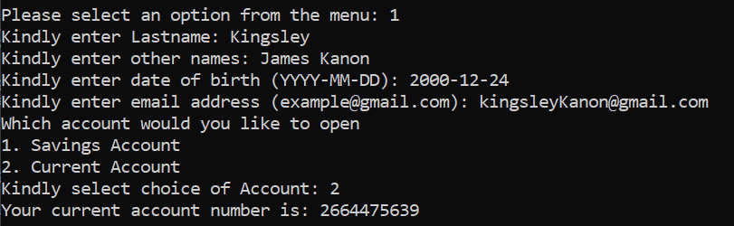
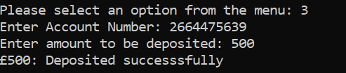

# 🚀 Simple Banking System - .NET Console Application
A clean, structured, and object‑oriented **banking system** built using **C# and .NET**.  
This project demonstrates my understanding of **software architecture**, **SOLID principles**, **file‑based persistence**, and **clean code practices** as part of my journey to becoming a professional .NET developer.

---

## 👨‍💻 Backend Skills Demonstrated

This project showcases practical knowledge of:

- C# object-oriented programming
- SOLID design principles
- Layered architecture
- Repository pattern
- Abstraction via interfaces
- Business rule enforcement
- File-based persistence
- Clean and maintainable code structure
- Separation of concerns  

Although implemented as a console application, the architecture mirrors production-style backend systems built with ASP.NET Core.
---

## 📌 Features
- Customer onboarding  
- Open Savings or Current accounts  
- Deposit and withdraw funds  
- View transaction history  
- Update customer profile (last name, email address)  
- Check account balance  
- Activate or deactivate an account  
- Input validation and error handling  
- State-based control flow
- Persistent storage of:
-- Accounts
-- Customers
-- Transactions

---

## 🧠 Concepts & Engineering Principles Applied

### Object-Oriented Programming

- Encapsulation
- Abstraction
- Inheritance
- Polymorphism
- Domain modeling

### SOLID Principles

- SRP (Single Responsibility Principle)
Each class handles one clearly defined responsibility.
- OCP (Open/Closed Principle)
New account types or features can be added without modifying core logic.
- LSP (Liskov Substitution Principle)
SavingsAccount and CurrentAccount behave consistently as Account types.
- ISP (Interface Segregation Principle)
Interfaces are small, specific, and purpose-driven.
- DIP (Dependency Inversion Principle)
Business logic depends on abstractions, not concrete file implementations.

---

## 🏗 Architecture Overview

```
┌────────────────────────┐
│        Presentation Layer      │
│  (Console UI, Input Helpers)   │
└───────────┬────────────┘
                │
┌───────────▼────────────┐
│         Application Layer      │
│   (Services, Business Logic)   │
└───────────┬────────────┘
                │
┌───────────▼────────────┐
│       Infrastructure Layer     │
│ (File Repositories, Logging)   │
└───────────┬────────────┘
                │
┌───────────▼────────────┐
│          Domain Layer          │
│ (Accounts, Customer, Models)   │
└────────────────────────┘
```

---

## 🛠 Technologies Used
- C#  
- .NET Console Application  
- File I/O for persistence  
- OOP and SOLID design  
- Custom validation utilities  
- Repository Pattern
- State-based control flow
- Dependency Injection
- Logging(Serilog)

---

## ▶ How to Run the Project
### Requirements
- .NET SDK (Specify your version, e.g., .NET 9)
- Git

### Setup 
```
git clone https://github.com/Jacob-Dev-Lab/Simple-Banking-System.git
cd Simple-Banking-System
dotnet restore
dotnet run
```  
---

## 🎥 Video Walkthrough

Watch a short demo of the application:

https://www.youtube.com/watch?v=6ZcPUEo-dYE

(The demo shows account creation, transactions, and persistent data behavior.)

---

## 📸 Screenshots

### Main Menu


### Create Account


### Deposit


### Transaction History


---

## 📘 What I Learned
This project helped me strengthen my understanding of:

- Designing a multi‑layered .NET application 
- Structuring business logic independently of UI 
- Applying SOLID principles in real code  
- Building abstractions using interfaces  
- Implementing repository abstraction 
- Managing persistent storage  
- Structuring a clean and maintainable codebase  
- Handling user input and validation  
- Modeling real‑world financial operations
- writing readable and maintainable backend code 

---

## 🔧 Future Improvements
- Replace file storage with EF Core + SQL Server  
- A web‑based version using ASP.NET Core  
- Add authentication and authorization

---

## 🎯 Purpose
This project is part of my journey as grow to becoming a professional .NET backend developer, focusing on writing clean, maintainable, and extensible code.

It represents my ability to design structured backend systems beyond basic CRUD implementations.

---

## 🔗 Connect
YouTube:  
`https://www.youtube.com/@dotnetdevjourneywithjacob` [(youtube.com in Bing)](https://www.bing.com/search?q="https%3A%2F%2Fwww.youtube.com%2F%40dotnetdevjourneywithjacob")

LinkedIn:  
`https://www.linkedin.com/in/jacoboluwajuwon` [(linkedin.com in Bing)](https://www.bing.com/search?q="https%3A%2F%2Fwww.linkedin.com%2Fin%2Fjacoboluwajuwon")